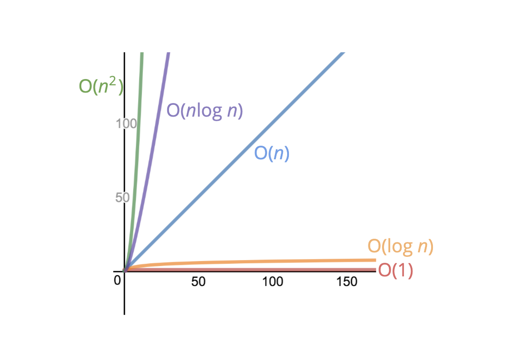
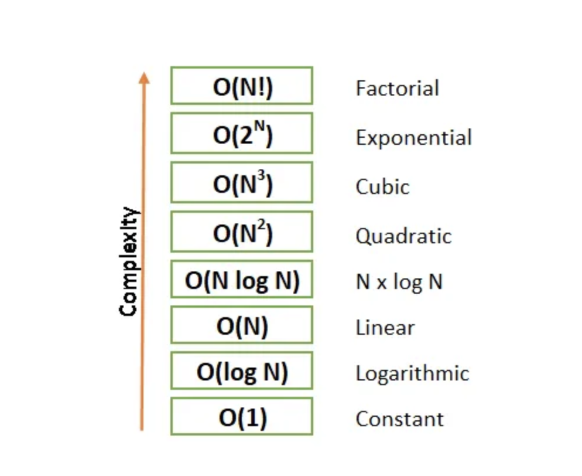
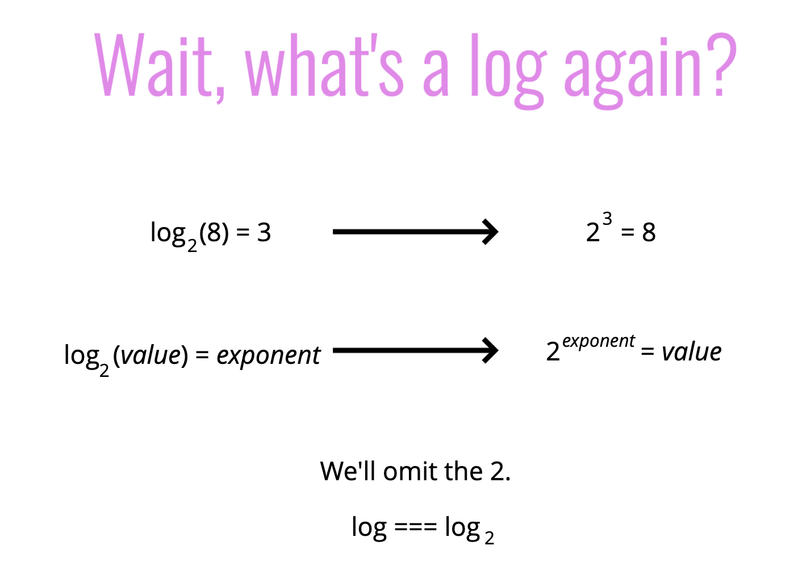
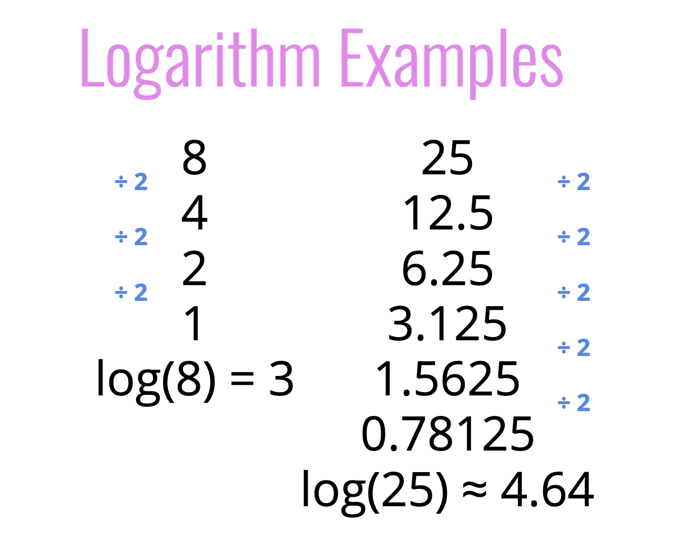

# Big O Notation

- an algorithm is **O(f(n))** if the number of simple operations the computer has to do is eventually less than a constant time **f(n)**, as **n** increases

## Key Points

- speed
- memory
- readability
- TIME & SPACE complexity
- general trends not precision

## Notes

- count number of simple operations
- talk formally about how the runtime of an algorithm grows as the input grows
- worst case scenario, upper bound of runtime
- constants do not matter **O(2n)** => **O(n)** or **O(500)** => **O(1)** or **$O(13n^2)$** => **$O(n^2)$**
  

  

  

  

  

## Space Complexity

- most primitives (booleans, numbers, undefined, null) are constant space
- strings require O(n) space (where n is the string length)
- reference types are generally O(n), where n is the length (for arrays) or the number of keys (for objects)

## Examples of Big O

- n \* (n + 1) / 2 is constant time (operations do not grow as n grows) O(1)
- single loop is linear time O(n)
- nested loop is quadratic time $O(n^2)$
