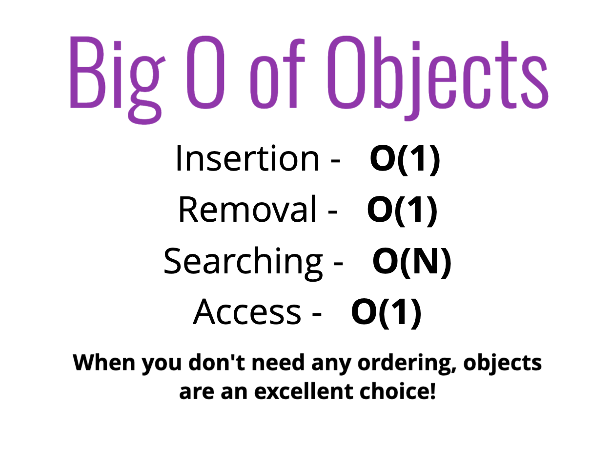
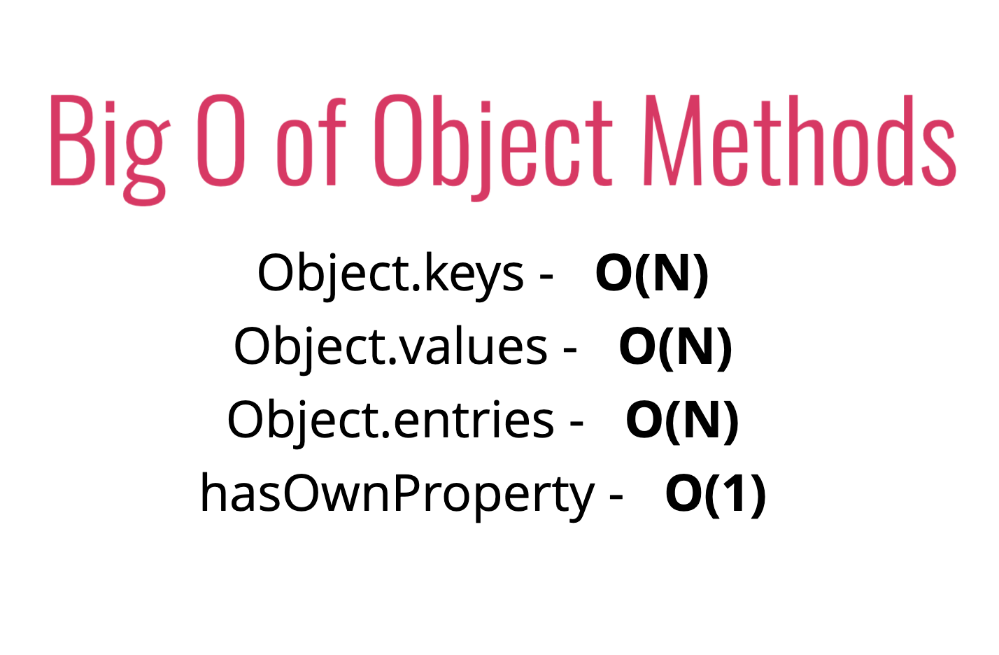
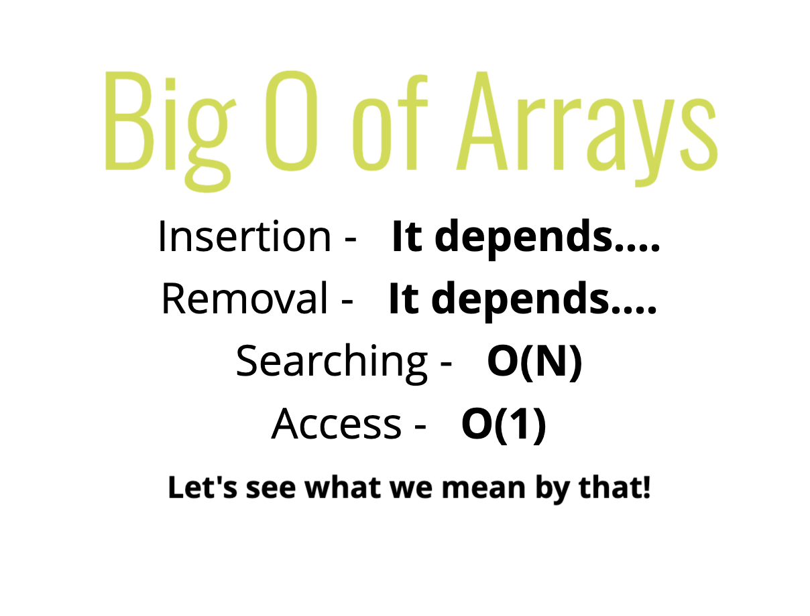
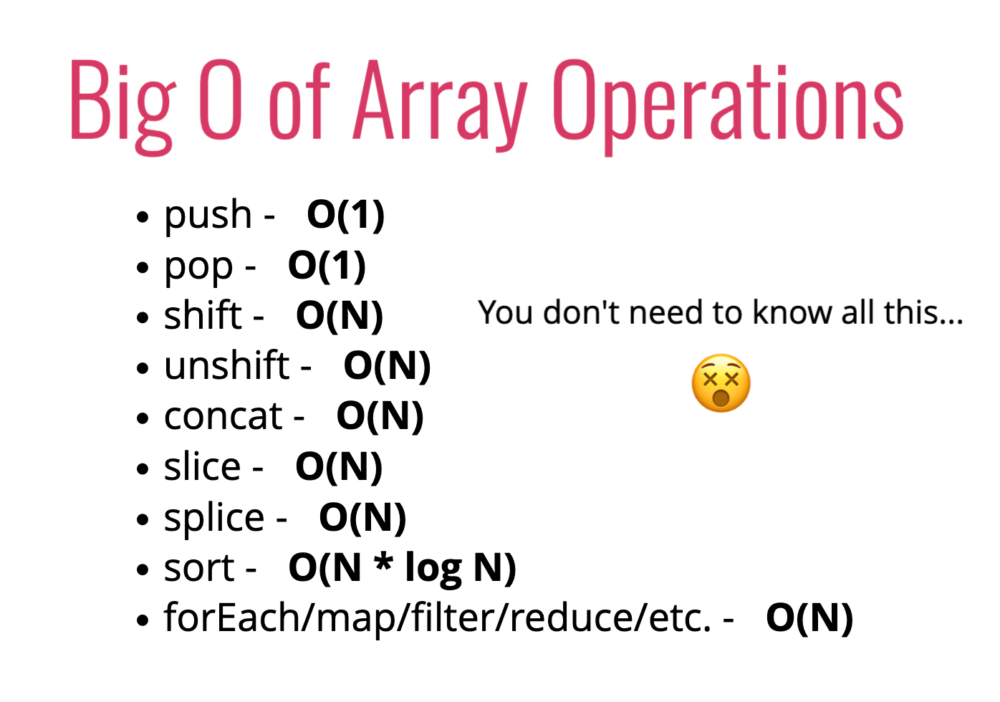

# Analyzing Performance of Arrays and Objects

## Objects

- unordered key value pair
  

  

  

## Arrays

- intrinsic ordered lists
- insertion and removal to beginning of array worse than adding to end because you have to re-index elements
- most operations are O(n), push and pop to end of array are O(1)
  

  

  

