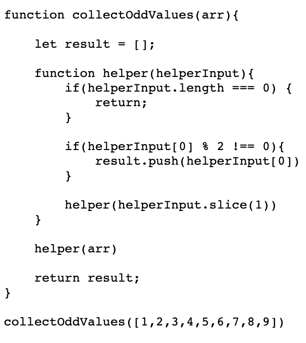
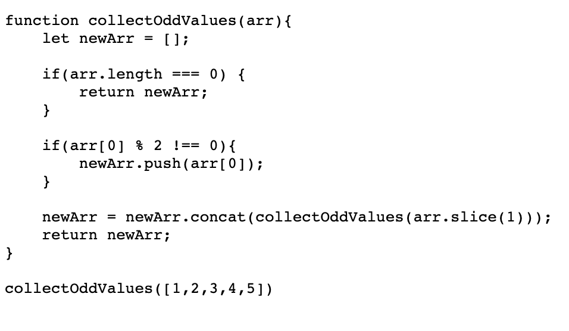

# Recursion

- a function that calls itself until you reach your base case
- sometimes cleaner alternative to iteration

## Examples

- JSON.parse / JSON.stringify
- document.getElementById
- DOM traversal algorithms
- Object traversal

## Notes

- **base case** is the condition when the recursion ends
- different/updated input for each function call

## Helper Method Recursion Pattern

- recursion function wrapped in helper method function
- outer function not recursive, inner function is recursive
- allows you to keep data that persists throughout instead of clearing each time function called if stored inside recursive function
  

  

## Pure Recursion Pattern

- for arrays use methods like **slice**, **spread**, or **concat** to make copies of arrays so you do not mutate them
- for strings use methods like **slice**, **substr**, or **substring** to make copies of strings since they are immutable
- for objects use **Object.assign**, or **spread** operator to make copies

  

  

