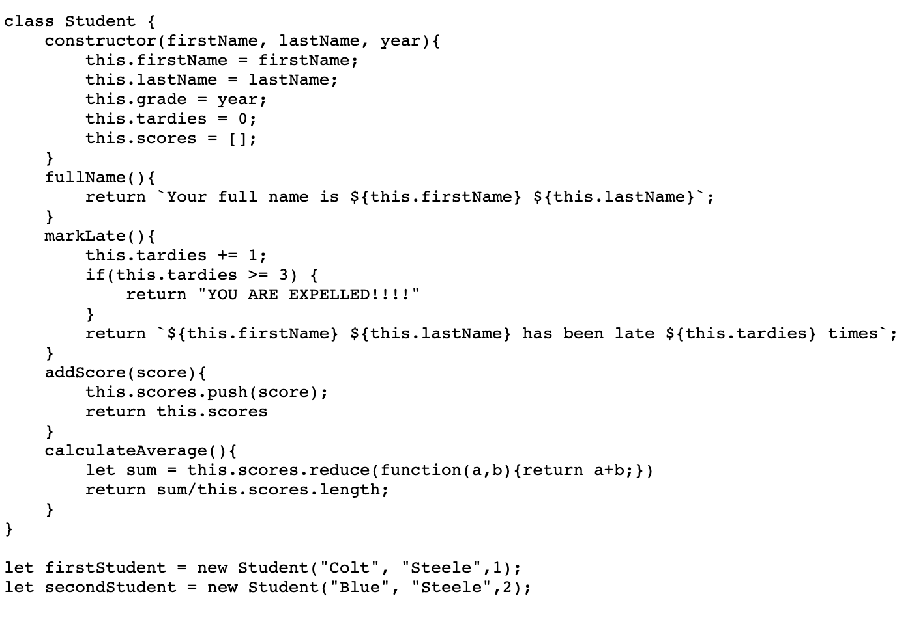

# Data Structures

- data structures are collections of values, the relationships among them, and the functions or operations that can be applied to the data

## ES2015 Class Review

- class should start with capital letter
- constructor initializes a newly created object / is the blueprint
- this keyword refers to individual instance of the class
- new keyword instantiates new instance of class
- instance methods provide functionality that pertains to single instance of that class
- class methods can be created with the static keyword
    

  

