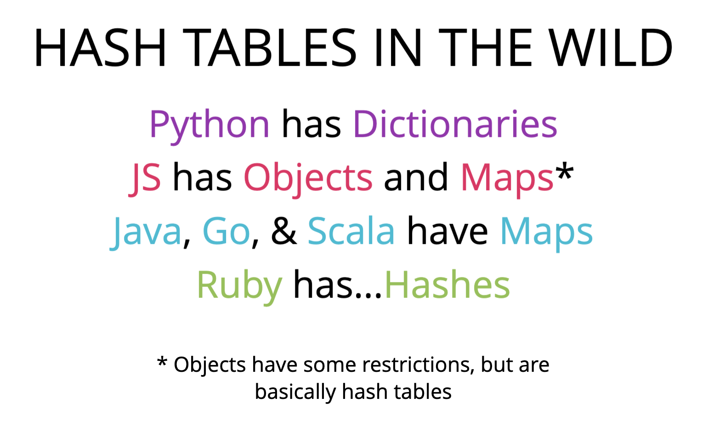
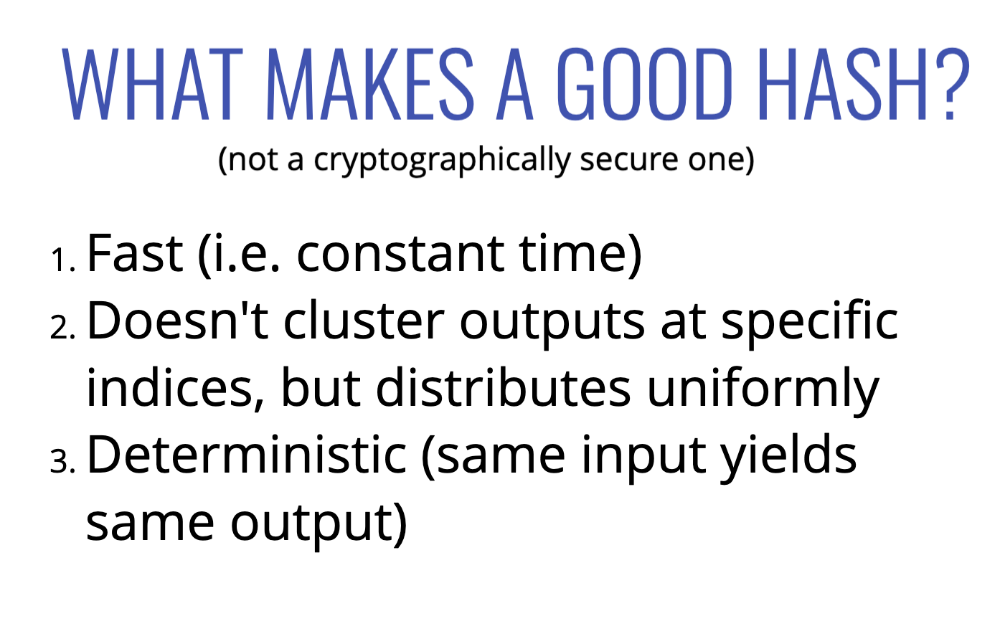

# Hash Tables

- unordered
- key value pairs
- fast for finding / removing / adding values
- insert / deletion / access are all on average constant time 0(1)

  

  

## Hash Functions

  

  

## Handling Collisions

1. Seperate Chaining

- store multiple key-value pairs at the same index

2. Linear Probing

- search through array to find the next empty slot
